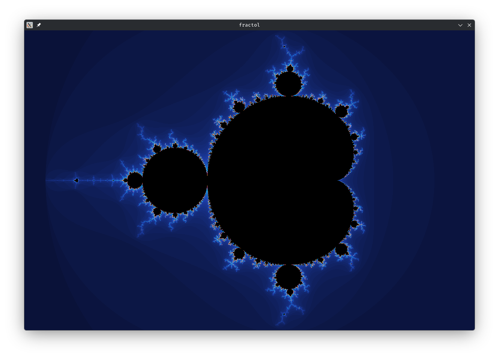
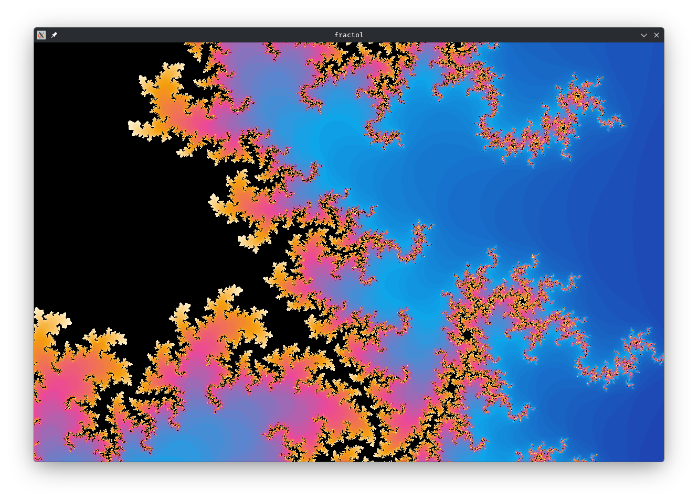
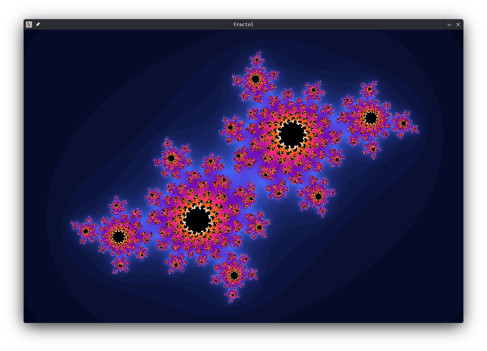

Fractal Viewer
==============

A compact, interactive Mandelbrot and Julia set viewer implemented in C
using MiniLibX. It is intended for learning and exploring complex-plane
rendering and color interpolation while remaining small and easy to read.

Preview
-------







Build & Run
-----------

1. Build:

```bash
make
```

2. Run examples:

```bash
./fractol mandelbrot
./fractol julia <real> <imag>
# e.g. ./fractol julia -0.4 0.6
```

